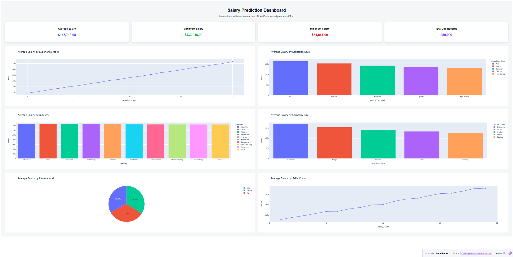
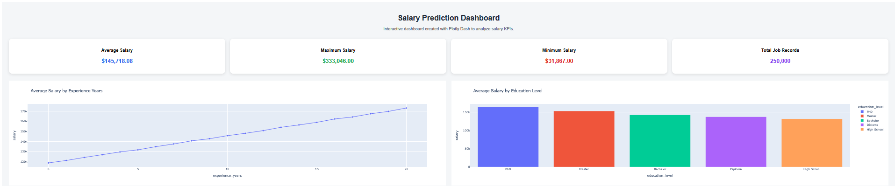
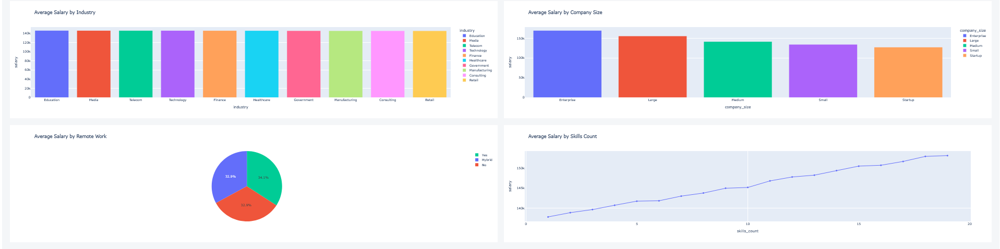

# S2 Data Migration

## Project Description

This project migrates salary prediction data from a CSV file into a PostgreSQL database table.

## Project Structure

```text
S2_Data_Migration/
│
├── README.md
├── .env.example
├── requirements.txt
├── data/
│   └── job_salary_prediction_dataset.csv
│
└── scripts/
    └── load_csv_to_db.py
```

## S3 API

This project also includes a FastAPI application to access the KPIs proposed in Stage 1.

## API Structure

```text
app/
├── setting.py
├── db.py
└── main.py
```
## S4 Dashboard

This project includes a dashboard created with Plotly Dash to visualize the main salary KPIs.

## Dashboard Structure

```text
dashboard/
└── app.py
```
## Dashboard Screenshots






```
